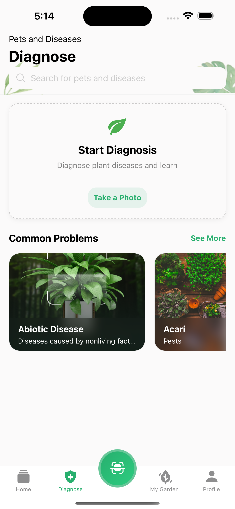
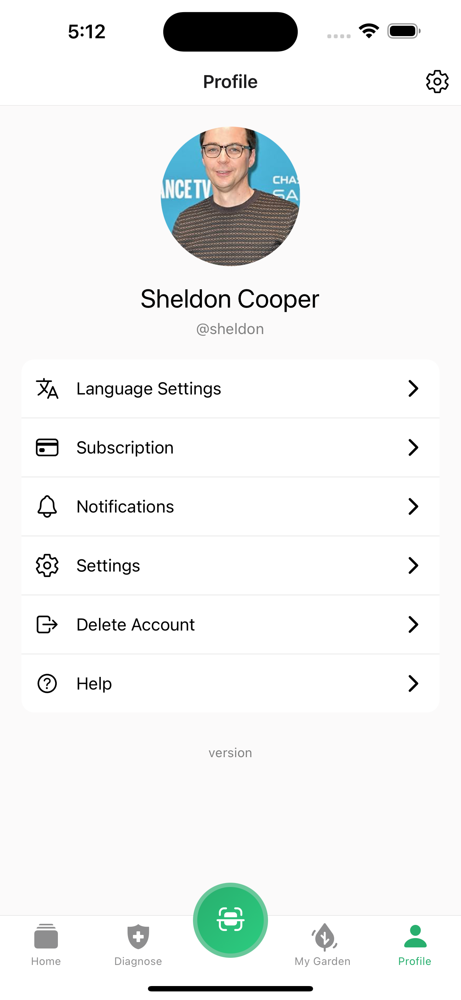

# PlantApp - Plant Recognition and Care Assistant


This is a Hubx Task for the React Native Developer position.

## Technologies and Tools

- **React Native**: Cross-platform mobile app development
- **Expo**: React Native framework for rapid development and deployment
- **TypeScript**: Type safety and enhanced IDE support
- **Redux Toolkit**: For state management
- **i18next**: Multi-language support (now just English)
- **React Navigation**: In-app navigation
- **Expo Router**: File-based routing system
- **React Native Reanimated 3**: For advanced animations
- **React Native Gesture Handler**: For gestures
- **Expo Camera**: Plant photo capture feature
- **Custom Components**: Reusable UI components

## Key Development Details

- **Platform Specific Codes**: Optimized codes for Android and iOS separately.
- **Comprehensive Testing**: Android and iOS platforms tested separately.
- **Redux Toolkit**: Used for efficient state management.
- **Multi-language Support**: Turkish, English, and German language options provided with i18n library.
- **Styling**: Only React Native's StyleSheet API used for all style definitions.
- **Animations**: Reanimated 3 preferred for smooth and performant animations.
- **Navigation**: File-based routing system implemented with Expo Router.

## Project Structure

```
plantapp/
├── app/                      # Expo Router based navigation structure
│   ├── (auth)/               # Authenticated user routes
│   │   ├── (modal)/          # Modal screens
│   │   ├── (settings)/       # Settings related screens
│   │   └── (tabs)/           # Main tab navigation screens
│   ├── (no-auth)/            # Non-authenticated user routes
│   ├── layout.tsx            # Root layout
│   ├── +html.tsx             # Custom HTML template for web
│   └── +not-found.tsx        # 404 Not Found screen
│
├── assets/                   # Static assets
│   ├── fonts/
│   ├── icons/
│   ├── images/
│   └── lotties/
│
├── components/               # Reusable React components
│   ├── common/               # Shared components
│   ├── screen/               # Screen-specific components
│   └── view/                 # Smaller view components
│
├── constants/                # App-wide constants
│
├── helpers/                  # Helper functions and utilities
│
├── hooks/                    # Custom React hooks
│
├── i18n/                     # Internationalization setup
│   ├── languages.ts
│   ├── index.ts
│   └── locales/
│       └── en-US/
│
├── store/                    # Redux store setup
│   ├── slices/               # Redux slices
│   └── index.ts
│
├── types/                    # TypeScript type definitions
│
├── .eslintrc.js              # ESLint configuration
├── .gitignore                # Git ignore file
├── app.json                  # Expo app configuration
├── babel.config.js           # Babel configuration
├── metro.config.js           # Metro bundler configuration
├── package.json              # Project dependencies and scripts
├── README.md                 # Project documentation
└── tsconfig.json             # TypeScript configuration
```

## Screenshots

### Onboarding Screens

<div style="display:flex; justify-content:space-around;">
    
    
    
    
</div>

### Main App Screens

<div style="display:flex; justify-content:space-around;">
    
    
    
    
    
      
</div>

### Additional Features

<div style="display:flex; justify-content:space-around;">
    
    
    
    
</div>

### Settings and Language

<div style="display:flex; justify-content:space-around;">
    
    
</div>

## Video Demo


## Installation

1. Clone the repository:

```bash
git clone https://github.com/furkananter/PlantApp-Hubx.git
```

2. Install dependencies:

```bash
npm install
```

3. Start the development server:

```bash
npx expo start
```

4. Scan the QR code with your Expo Go app on your mobile device to run the app.

Enjoy coding!
